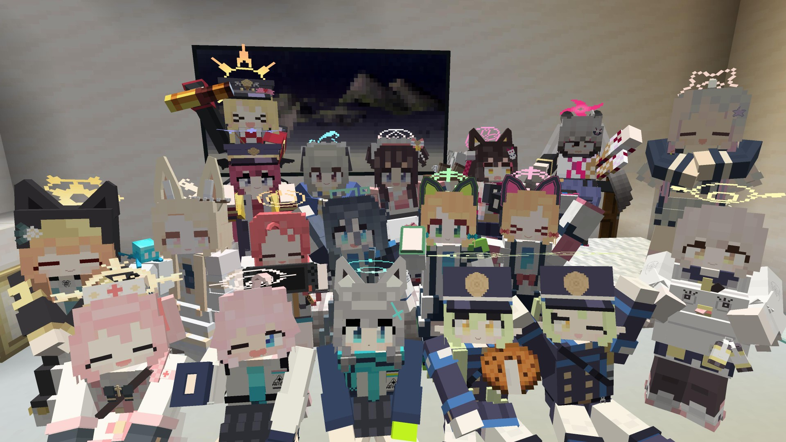
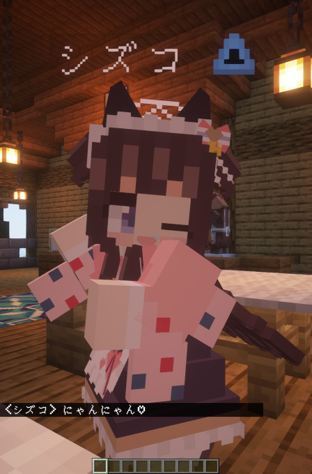
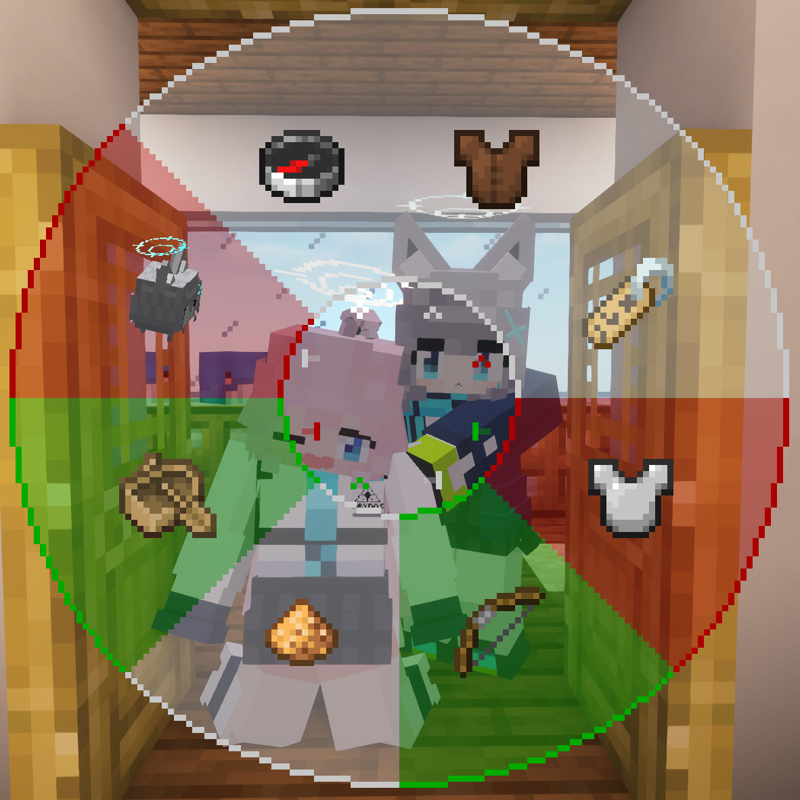
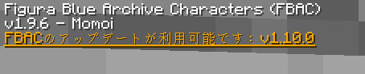
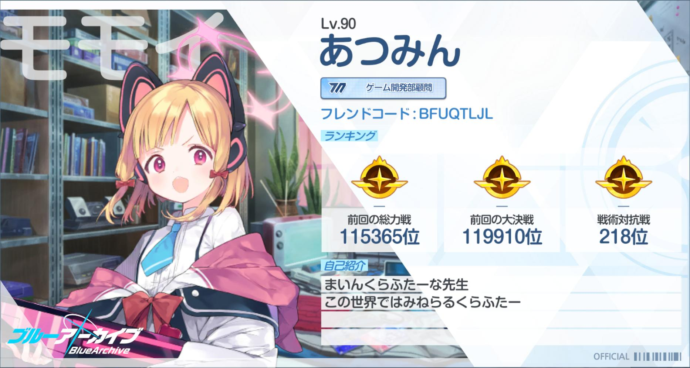

Language: 　**English**　|　[日本語](./README_jp.md)

# FiguraBlueArchiveCharacters
<!-- DESCRIPTION_START -->
This is the avatars for [Figura](https://modrinth.com/mod/figura), the skin mod for [Minecraft](https://www.minecraft.net/en-us) Java Edition, which are imitated characters who appear in "[Blue Archive](https://bluearchive.jp/)" the game for mobile devices.

Target figura version: [0.1.4](https://modrinth.com/mod/figura/version/0.1.4+1.20.1)

(Some avatar functions don't work correctly in Minecraft 1.20.4 doe to [a bug in Figura](https://github.com/FiguraMC/Figura/issues/197). I recommend using in Minecraft 1.20.1.)
<!-- DESCRIPTION_END -->

(You can watch the introduction video by clicking the above image.)

Watch also:
- [FBAC videos playlist](https://youtube.com/playlist?list=PLTN-ereqPxq9N_3SI0zvIE-f6MhBpZ52U&si=AOZ1et55lUzqA-lm)
- [FBAC short videos playlist](https://youtube.com/playlist?list=PLTN-ereqPxq9OP7sIgSyHLK9JXk4mxIKk&si=ddSN5eqrJqhgsUfN)

## Creation status
### Done
The avatars for these characters are completed. You can download and use avatars below in the game according to the chapter "[How to use](https://github.com/Gakuto1112/FiguraBlueArchiveCharacters/blob/base/.github/README.md#how-to-use)".

- Shizuko Kawawa
- Izuna Kuda
- Mari Iochi
- Momoi Saiba
- Midori Saiba
- Shiroko Sunaookami
- Hoshino Takanashi
- Umika Satohama
- Serina Sumi
- Iroha Natsume
- Ibuki Tanga
- Seia Yurizono

### In progress
The avatars for these characters are worked in progress. It usually takes about 2~3 weeks, but works have been delayed because of my recently busy schedule. Click on the link in brackets to go to the issue about the character, where you can check the progress.

- Aris Tendo ([#97](https://github.com/Gakuto1112/FiguraBlueArchiveCharacters/issues/97))

### Planned
Although the avatars for these characters are not created, there are plans to create them in the future. They will be created in order from top to bottom. This is just a plan and the order may change or creation may be discontinued.

- Yuzu Hanaoka ([#97](https://github.com/Gakuto1112/FiguraBlueArchiveCharacters/issues/97))
- Hihumi Ajitani ([#39](https://github.com/Gakuto1112/FiguraBlueArchiveCharacters/issues/39))
- Yuka Hayase ([#102](https://github.com/Gakuto1112/FiguraBlueArchiveCharacters/issues/102))
- Serika Kuromi ([#37](https://github.com/Gakuto1112/FiguraBlueArchiveCharacters/issues/37))

### Requested
I have received requests to create these characters. However, I can't promise that I'll create them. Please understand this.

- Haruka Igusa ([#98](https://github.com/Gakuto1112/FiguraBlueArchiveCharacters/issues/98))
- Toki Asuma ([#104](https://github.com/Gakuto1112/FiguraBlueArchiveCharacters/issues/104))
- Aru Rikuhachima ([#103](https://github.com/Gakuto1112/FiguraBlueArchiveCharacters/issues/103))

## Features
- Imitated ex skill cut-ins.

  

- An object remains after the ex skill if the ex skill type is "leaving something in a place".
  - The object doesn't affect the game at all.
  - The object will be remove when the hit boxes of a block and it are overlapped.
  - You can remove all placement objects by holding the Ex skill key (default: V).

  

- Press cursor keys (↑→↓←) to show speech bubbles.
  - The "reload" speech bubble will appear automatically while loading a crossbow.

  

  

- Holds the character's specific weapon instead of bows and crossbows. Shoots bullets instead of arrows.
  - Note that these changes are only in appearance. You are just shooting arrows in actual.

  

- A barrier will applied when the player has absorption hearts (yellow hearts).

  

- Will be rescued by the helicopter when the player dies.
  - This animation won't visible if the player isn't visible because of Minecraft and Figura specifications.

  

- Can change costume if the character has multiple costumes.

  

- Some characters have unique models for in-game vehicles.

  

- Can change your display name to the character's name.
  - Can also display the club name which the character is participated in.
  - **Other players also need to install Figura and give enough permissions** to see your display name.

  

- A cake emoji will be added during the student's birthday.
  - It won't be displayed if the display name is the player name.

  

- In addition to the above, there are other features that available only to certain characters.

  (Character names in the below table with parentheses indicate functions related to a specific costume, while those without parentheses indicate functions not related to a costume.)

  | Character name | Features |
  | - | - |
  | Shizuko (Normal) | - Leaves a stall in place after playing the Ex Skill. |
  | Izuna (Normal) | - Has a special performance when warping with ender pearl, etc. |
  | Shiroko | - Grabs her drone and fries away during creative flights.   - Her drone can launch missiles (visual only).   - The horse is replaced with her bicycle when riding a horse, mule, or donkey with a saddle.   - Drinking portions are replaced with a sports bottle when riding a bicycle (horses). |
  | Hoshino | - The shield is replaced with her own. |
  | Hoshino (Swimsuit) | - The boat are replaced with a whale float when she is alone in the boat. |
  | Hoshino (Battle) | - Holds her shotgun and handgun when you holds bows or crossbows with both hands. |
  | Umika | - Leaves a firework launcher in place after playing the Ex Skill.   - Firework launchers can launch fireworks (visual only). |
  | Serina (Normal) | - Leaves a medical box in place after playing the Ex Skill.   - Medical boxes play performances to cure when a player (not only you) touches it.   - Hearing potions are replaced with a medical box. |
  | Serina (Christmas) | - Bells are replaced with her handbell.   - Can play Christmas songs with her handbell after playing the Ex Skill. (7 songs). |
  | Iroha | - The camel are replaced with Toramaru (a tank) when she is alone on the camel with a saddle.   - Toramaru can shoot a shell (visual only). |
  | Ibuki | - I can patrol with Iroha! |
  | Seia | - Has an [allay](https://minecraft.wiki/w/Allay) as a companion (this is a substitute for the long-tailed tit.). |

## Ex Skill
The familiar Ex skill cut-in from the original game is imitated. To play Ex skill cut-in, press the Ex skill key (default is "G" key) while in the **third-person perspective**.

> [!IMPORTANT]
> From v1.9.4, the Ex skill action play key has been changed from the "V" key to the "G" key.

Some characters have the secondary Ex skill. It can be played by pressing the "H" key.

Ex skill cut-ins are only visual and have no effect. However, some Ex skills leave objects in place after the cut-in (also only visual).

> [!NOTE]
> - Ex skill animations are designed for the case where the screen ratio is 16:9. Although you can play them in a screen ratio other than 16:9, but some parts may be crowded out of the screen.
> - Ex skill animations are design for the case where the field of view (FOV) is standard (70). The FOV will be temporarily adjusted to the standard if it is not standard. However, use of some other mods or FOV changes because of changes of the player's movement speed prevents the script from adjusting it.

## The action wheel
Figura provides the action wheel with which players can play some actions (emotes, animations, configs, and etc.). It will be shown when holding the action wheel key (default is B key). This avatar also has some actions.

> [!IMPORTANT]
> From v1.8.4, the Ex skill action has been changed to play on key press.

### Action 1. Change costume
Changes costume if the character has multiple costumes. Scroll to select the costume and closing the action wheel to confirm. Left-click to reset to current selection, and right-clock to reset to default during selection.

### Action 2. Change display name
Changes the player's display name. Scroll to select the name and closing the action wheel to confirm. Left-click to reset to current selection, and right-clock to reset to default during selection. However, **Other players also need to install Figura and give enough permissions** to see your display name.

### Action 3. Toggle armors visible
Toggles whether equipped armors are visible or not. Some costumes will be hidden not to interfere with the armors while equips them. This setting will only affects to vanilla armors.

I recommend to hide armors because they hide the avatar.

### Action 4. Toggle first-person weapon models
Toggles whether weapon models (including students' guns) are visible or not in first person perspective. If toggled off, Minecraft items will be displayed instead. Regardless of this setting, weapon models are always displayed in third person perspective.

### Action 5. Change amount of Ex skill frame particles
Changes the amount of triangular particles that appear from the red or blue borders that appear during Ex skill animations. Reducing or disabling particles may improve performance.

As an additional option, I have added an option to disable the frame during the Ex skill animations. This is the closest to the original one.

### Action 6. Toggle vehicle models
Toggles the vehicle models replacement feature for some characters. This option is disabled for characters with no vehicle models.

### Action 7. Check for FBAC updates
Left click to check for FBAC updates. You can try to check updates again even if the check fails. In addition to manually checking for updates from here, the script will automatically check for updates once a day.

> [!IMPORTANT]
> To check for FBAC updates, you must turn on "Allow Networking" and add `api.github.com` to the Network Filter from Figura settings! Please note that as of Figura v0.1.4, the network filter is reset every time the game is restarted ([Refer](https://github.com/FiguraMC/Figura/issues/238)).

> [!CAUTION]
> It is DANGEROUS to use a network filter other than "Whitelist" when activating Figura's Networking Feature. Although this avatar uses secure links, there is no guarantee that links used by other players' avatars are secure. I'm not responsible for any damages caused by using this feature.

> [!WARNING]
> If you repeatedly check for updates in a short period of time, GitHub will impose a temporary restriction and avatar scripts will not be able to check for updates for a while.

Right click to copy the latest FBAC download link to your clipboard. Please access the download page from your browser.Please note that if you have not checked for updates once or have not checked for updates for a long period of time, you will not get the correct link.

## FBAC version display
From v2.0.0, when the action wheel is open, the version of FBAC currently in use and whether it has been updated are displayed in the upper left corner of the screen.

Updates are automatically checked once a day, but can also be done manually via the [action wheel](#action-7-check-for-fbac-updates).

A notification will be sent when a new FBAC version is available. You can get the download link for the latest version from the [action wheel](#action-7-check-for-fbac-updates), which you can access from your browser.

> [!IMPORTANT]
> To check for FBAC updates, you must turn on "Allow Networking" and add `api.github.com` to the Network Filter from Figura settings! Please note that as of Figura v0.1.4, the network filter is reset every time the game is restarted ([Refer](https://github.com/FiguraMC/Figura/issues/238)).

> [!CAUTION]
> It is DANGEROUS to use a network filter other than "Whitelist" when activating Figura's Networking Feature. Although this avatar uses secure links, there is no guarantee that links used by other players' avatars are secure. I'm not responsible for any damages caused by using this feature.

> [!WARNING]
> If you repeatedly check for updates in a short period of time, GitHub will impose a temporary restriction and avatar scripts will not be able to check for updates for a while.

## How to use
Figura is available in [Forge](https://files.minecraftforge.net/net/minecraftforge/forge/), [Fabric](https://fabricmc.net/) and [NeoForge](https://neoforged.net/).

1. Install the mod loader which you want to use and make the mods available.
2. Install [Figura](https://modrinth.com/mod/figura). Note the mod dependencies.
3. Go to the [release page](https://github.com/Gakuto1112/FiguraBlueArchiveCharacters/releases).
   - You can also go there from the right side of [the repository's home page](https://github.com/Gakuto1112/FiguraBlueArchiveCharacters).
4. Download the avatar of your choice that attached to "Assets" section of the release notes.
5. Unzip the zipped file and take the avatar data inside this.
6. Put avatar files at `<minecraft_instance_directory>/figura/avatars/`.
   - The directory will automatically generated after launching the game with Figura installed. You can also create it manually if it doesn't exist.
7. Open the Figura menu (Δ mark) from the game menu.
8. Select the avatar from the avatar list at the left of the Figura menu.
9. Sets your permission if you need.
10. Other Figura players can see your avatar after uploading your avatar to the Figura server.
    - **If your Minecraft is Pirated (cracked, unlicensed, free), you cannot upload your avatar.** This is a Figura specification and I cannot help you with this.

## Notes
- I'm not responsible for any damages caused by using this avatar.
- This avatar is designed for work with no resource pack and no other mods are installed. An unexpected issue may occurs when you use it with any resource packs and mods (texture and armor inconsistencies, etc.). However, I may not support you in these cases.
- Please [report an issue](https://github.com/Gakuto1112/FiguraBlueArchiveCharacters/issues) if you find it.
- Please contact me via [Discussions](https://github.com/Gakuto1112/FiguraBlueArchiveCharacters/discussions) or [Discord](https://discord.com/) if you want to do for my avatars. My Discord name is "vinny_san" and display name is "ばにーさん". My display name in [Figura Discord server](https://discord.gg/figuramc) is "BunnySan/ばにーさん".

---

