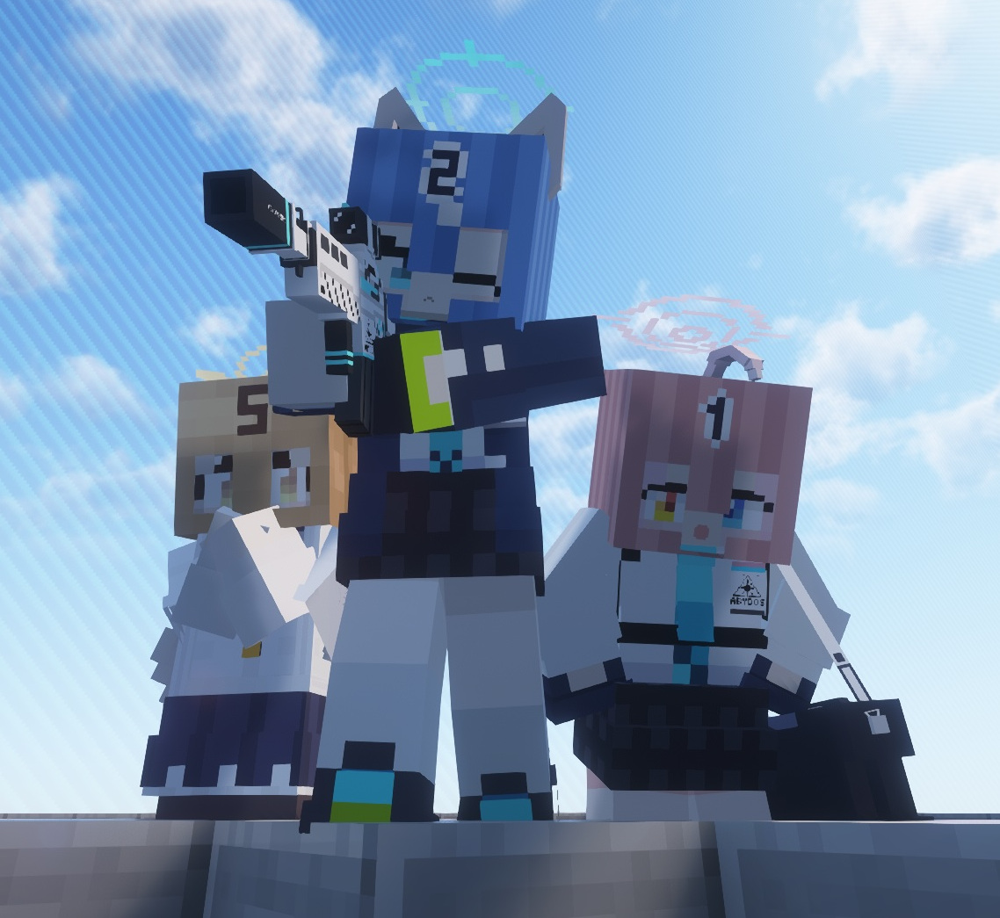
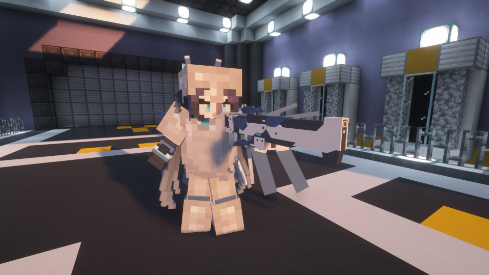

Language: 　**English**　|　[日本語](./README_jp.md)

# FiguraBlueArchiveCrafters

(Formerly: Figura Blue Archive Characters)

<!-- DESCRIPTION_START -->
Avatar data for [Figura](https://modrinth.com/mod/figura), a skin mod for [Minecraft](https://www.minecraft.net/en-us) Java Edition, recreating characters from the mobile game "[Blue Archive](https://bluearchive.jp/)".

Target Figura version: [0.1.5](https://modrinth.com/mod/figura/version/0.1.5b+1.21.4)

<!-- DESCRIPTION_END -->

<https://youtu.be/JrPhLR34mLA>

---

**\[NEW!\]** I released an FBAC animation video inspired by a sensei's daily life!
Please take a look!

<https://youtu.be/GfJJ7iNA_Bs>

---

Watch also:

- [FBAC videos playlist](https://youtube.com/playlist?list=PLTN-ereqPxq9N_3SI0zvIE-f6MhBpZ52U&si=AOZ1et55lUzqA-lm)
- [FBAC short videos playlist](https://youtube.com/playlist?list=PLTN-ereqPxq9OP7sIgSyHLK9JXk4mxIKk&si=ddSN5eqrJqhgsUfN)

<!-- CREATION_STATUS -->

## Features

- Ex Skill cut-ins are recreated.

  

- For Ex Skills that "leave something in place", an object remains after the Ex Skill animation.
  - It does not affect gameplay at all.
  - The object disappears when its collision overlaps with a block.
  - Hold the Ex Skill play key (default: V) to remove all placed objects.

  

- Student-specific weapons are held instead of bows and crossbows.
  Bullets are fired instead of arrows.
  - This is visual only. In actual gameplay, you are still firing arrows.

  

- Speech bubbles can be shown with the arrow keys (up/right/down/left).
  - While loading a crossbow, a reload bubble appears automatically.

  

  

- A barrier appears when the player has Absorption hearts (yellow hearts).

  

- When the player dies, they are recovered by helicopter.
  - Due to Minecraft and Figura behavior, this animation is not shown if the player is not rendered.

  

- Some students have unique models for in-game vehicles.

  

- The player's displayed name can be changed to a student's name.
  - Club names can also be displayed.
  - For other players to see this name, **they also need Figura and must grant you sufficient trust settings on their side**.

  

- On each student's birthday, a small cake mark is added to the name.
  - It is not shown when the displayed name is the player name.

  

- In addition to the above, there are features available only for specific students.

  | Student | Features |
  | - | - |
  | Shizuko (Normal) | - Leaves a stall in place after playing the Ex Skill. |
  | Izuna | - Has a special effect when warping with an Ender Pearl, etc. |
  | Shiroko | - During creative flight, she flies while holding onto her drone.   - Her drone can launch missiles (visual only).   - Saddled horse-type mobs are replaced with her bicycle.   - While riding the bicycle, drinkable potions are replaced with a sports bottle. |
  | Hoshino | - Shields are replaced with her unique model. |
  | Hoshino (Swimsuit) | - If she is alone in a boat, the boat is replaced with a whale float. |
  | Hoshino (Battle) | - Holds a shotgun and handgun when using bows/crossbows in both hands. |
  | Umika | - Leaves a fireworks launcher in place after playing the Ex Skill.   - Fireworks launchers can launch fireworks (visual only). |
  | Serina (Normal) | - Leaves a medical box in place after playing the Ex Skill.   - Medical boxes play a healing-like effect when touched by players (including other players).   - Healing potions are replaced with a medical box. |
  | Serina (Christmas) | - Bells are replaced with her handbell.   - After Ex Skill playback, she can perform random Christmas songs with her handbell (7 songs). |
  | Iroha | - If she rides a saddled camel alone, the camel is replaced with Toramaru (a tank). Only Ibuki can ride with Iroha on Toramaru.   - Toramaru can fire shells (visual only). |
  | Ibuki | - Can patrol with Iroha-senpai! |
  | Seia | - Has an [allay](https://minecraft.wiki/w/Allay) as a companion (as a substitute for a long-tailed tit).   - Saddled horse-type mobs are replaced with her convertible. |
  | Aris | - After playing the Ex Skill animation, her railgun enters an overcharged state and can fire a stronger shot (visual only). |
  | Aris (Battle) | - Has a dedicated animation during creative flight. |
  | Yuzu (Maid) | - Can equip the Yuzu Chest by wearing a pumpkin on the head. Sneaking hides her inside the chest. |
  | Hikari | - Can dance with Nozomi. |
  | Nozomi | - Charges a train after playing the Ex Skill (visual only).   - Can dance with Hikari. |
  | Reisa (Normal) | - Slams a challenge letter in front of her after playing the Ex Skill. It has provocative words written on it. |
  | Reisa (Magical) | - Gains a small amount of magical power after playing the Ex Skill. |
  | Michiru | - Has a special effect when warping with an Ender Pearl, etc.   - Swords and firework rockets are replaced with unique models. |
  | Hifumi (Normal) | - Places a Peroro doll in front of her after playing the Ex Skill (visual only). |
  | Hifumi (Swimsuit) | - If she rides a saddled camel alone, the camel is replaced with Crusader-chan (a tank).   - Crusader-chan can fire shells (visual only). |
  | Hina (Swimsuit) | - Equips a swim ring when wearing a Turtle Shell (helmet). Not applied while armor is visible. |
  | Hanae (Normal) | - Regeneration potions are replaced with a medical box. |

## Ex Skill

The familiar Ex Skill cut-in from the original game is recreated.
To play an Ex Skill, press the Ex Skill key (default: "G") in **third-person view**.

> [!IMPORTANT]
> From v1.9.4, the Ex Skill action key was changed from "V" to "G".

Some students have two Ex Skills.
The secondary Ex Skill can be played with the "H" key.

Ex Skill cut-ins are visual only and have no gameplay effect.
However, some Ex Skills leave objects in place after the cut-in (also visual only).

> [!NOTE]
>
> - Ex Skill animations are designed for a 16:9 screen ratio.
>   They can still be played in other ratios, but parts may be cut off.
> - Ex Skill animations are designed for the standard field of view (FOV 70).
>   If your FOV is not standard, it is temporarily corrected during Ex Skill playback.
>   However, this correction may fail in some environments, such as when using certain mods together or when FOV changes due to movement-speed effects.

## The action wheel

Figura includes an action wheel (default key: "B") that lets players perform actions such as emotes.
This repository's avatars include shared actions.

> [!IMPORTANT]
> From v1.8.4, the Ex Skill action was changed to key-based playback.

### Action 1. Change variation costume

If variation costumes are available (costume changes that do not change Ex Skills), you can switch costumes.

### Action 2. Change display name

Changes the player's displayed name.
Scroll to choose a name, then close the action wheel to confirm.
Left-click resets to the current value during selection, and right-click resets to the default.
However, for other players to see the changed name, **they also need Figura and must grant you sufficient trust settings on their side**.

### Action 3. Toggle armor visibility

Toggles whether armor is visible.
Since armor can hide the avatar, I recommend hiding armor.

### Action 4. Open avatar settings

Moves to the [avatar settings page](#avatar-settings-action-wheel).

## Avatar settings action wheel

You can move to this page from [Action 4](#action-4-open-avatar-settings) in [The action wheel](#the-action-wheel).

### Action 1. Toggle student-specific vehicle models

Toggles whether student-specific vehicle model replacement is enabled.
This option is disabled for students without vehicle replacements.

### Action 2. Toggle halo force rendering mode

Toggles halo force rendering mode on/off.

[To reproduce behavior close to the original setting](https://dic.pixiv.net/a/ヘイロー%28ブルーアーカイブ%29#:~:text=シナリオライターが言及\)-,ヘイローは影が投影されない%E3%80%82), halo shadows are not projected when shader packs are used.
As a side effect of this behavior, halos may not render correctly in some situations.
If that happens, enable halo force rendering mode.
This mode is reset to off each time the avatar is reloaded.

#### Confirmed scene where halo may fail to render

- When using [Freecam](https://modrinth.com/mod/freecam) in free camera view with a shader pack.

### Action 3. FPM compatibility mode

A mode for compatibility with [First-person Model](https://modrinth.com/mod/first-person-model).
When enabled, the head is hidden only in first-person view.
In some environments, the head may fail to render; in that case, disable this mode.

#### Confirmed scene where the head may fail to render

- When using [Freecam](https://modrinth.com/mod/freecam) in free camera view.

### Action 4. Reload language data

Click to clear the FBAC avatar language-data cache and reload it from remote.
Use this when language data has issues or when you want to refresh manually.
In addition to manual refresh, update checks run automatically once a day, and if new data is found, it is updated automatically.

> [!IMPORTANT]
> To check updates, you must enable "Allow Networking" in Figura settings and add `raw.githubusercontent.com` to the network whitelist.

> [!CAUTION]
> It is dangerous to operate Figura's Networking feature with a network filter mode other than "Whitelist".
> This avatar uses safe links, but there is no guarantee that links used by other players' avatars are safe.
> I am not responsible for any damage caused by using this feature.

### Action 5. Check for FBAC updates

Left-click checks whether FBAC updates are available.
Even if the update check fails, you can retry from this action.
In addition to manual checks here, update checks are also run automatically once a day.

> [!IMPORTANT]
> To check updates, you must enable "Allow Networking" in Figura settings and add `api.github.com` to the network whitelist.

> [!CAUTION]
> It is dangerous to operate Figura's Networking feature with a network filter mode other than "Whitelist".
> This avatar uses safe links, but there is no guarantee that links used by other players' avatars are safe.
> I am not responsible for any damage caused by using this feature.

> [!WARNING]
> Repeating update checks in a short period may trigger temporary limits from GitHub, and update checks may become unavailable for a while.

Right-click copies the latest FBAC download link to your clipboard.
Open the download page from your browser.
Please note that if you have never checked updates, or have not checked for a long time, the link may not be valid.

## FBAC version display

From v2.0.0, while the action wheel is open, the current FBAC version and update status are shown in the top-left corner of the screen.
From v3.0.0, the language-data version is also shown.

FBAC and language-data updates are checked automatically once a day, and can also be checked manually from the [Avatar settings action wheel](#avatar-settings-action-wheel).

When a new FBAC version is available, a notification is shown.
You can get the latest download link from the [Avatar settings action wheel](#avatar-settings-action-wheel) and open it in your browser.

When a new language-data version is available, it is downloaded automatically.
No special operation is needed.

> [!IMPORTANT]
> To check updates, you must enable "Allow Networking" in Figura settings and add both `api.github.com` and `raw.githubusercontent.com` to the network whitelist.

> [!CAUTION]
> It is dangerous to operate Figura's Networking feature with a network filter mode other than "Whitelist".
> This avatar uses safe links, but there is no guarantee that links used by other players' avatars are safe.
> I am not responsible for any damage caused by using this feature.

> [!WARNING]
> Repeating update checks in a short period may trigger temporary limits from GitHub, and update checks may become unavailable for a while.

<!-- USAGE_START -->
## How to use

Figura is available in [Forge](https://files.minecraftforge.net/net/minecraftforge/forge/), [Fabric](https://fabricmc.net/) and [NeoForge](https://neoforged.net/).

1. Install the mod loader which you want to use and make the mods available.
2. Install [Figura](https://modrinth.com/mod/figura). Note the mod dependencies.
3. Go to the [release page](https://github.com/Gakuto1112/FiguraBlueArchiveCrafters/releases).
4. Download the zip file attached in "Assets" section of the release notes.
5. Unzip the zipped file and take the avatar data inside this.
6. Put avatar files at `<minecraft_instance_directory>/figura/avatars/`.
   - The directory will automatically generated after launching the game with Figura installed. You can also create it manually if it doesn't exist.
7. Open the Figura menu (Δ mark) from the game menu.
8. Select the avatar from the avatar list at the left of the Figura menu.
9. In order for the avatar to work properly, you need to allow network communication.
   Go to the Figura menu → Settings → "Networking" category and update the following settings.
   - Allow Networking → "Enabled"
   - Networking Restriction → "Whitelist"
10. Add the following entries to the "Network Filter" in the same category.
    - api.github.com
    - raw.githubusercontent.com
11. By uploading your avatar to the Figura server in Figura menu, other Figura players can see your avatar.
    - **If your Minecraft is Pirated (cracked, unlicensed, free), you cannot upload your avatar.**
      This is a Figura specification and I cannot help you with this.
<!-- USAGE_END -->

<!-- NOTES_START -->
## Notes

- I'm not responsible for any damages caused by using this avatar.
- This avatar is designed for work with no resource pack and no other mods are installed.
  An unexpected issue may occurs when you use it with any resource packs and mods (texture and armor inconsistencies, etc.).
  However, I may not support you in these cases.
- Please [report an issue](https://github.com/Gakuto1112/FiguraBlueArchiveCrafters/issues) if you find it.
- Please contact me via [Discussions](https://github.com/Gakuto1112/FiguraBlueArchiveCrafters/discussions) or [Discord](https://discord.com/) if you want to do for my avatars.
  My Discord name is "vinny_san" and display name is "ばにーさん".
  My display name in [Figura Discord server](https://discord.gg/figuramc) is "BunnySan/ばにーさん".
<!-- NOTES_END -->

---

