言語: 　[English](./README.md)　|　**日本語**

# FiguraBlueArchiveCrafters

（旧称：Figura Blue Archive Characters）

スマートフォンゲーム「[ブルーアーカイブ](https://bluearchive.jp/)」に登場するキャラクターを再現した、[Minecraft](https://www.minecraft.net/ja-jp) Java EditionのスキンMod「[Figura](https://modrinth.com/mod/figura)」で使用できるアバターデータです。

ターゲットFiguraバージョン：[0.1.5](https://modrinth.com/mod/figura/version/0.1.5b+1.21.4)

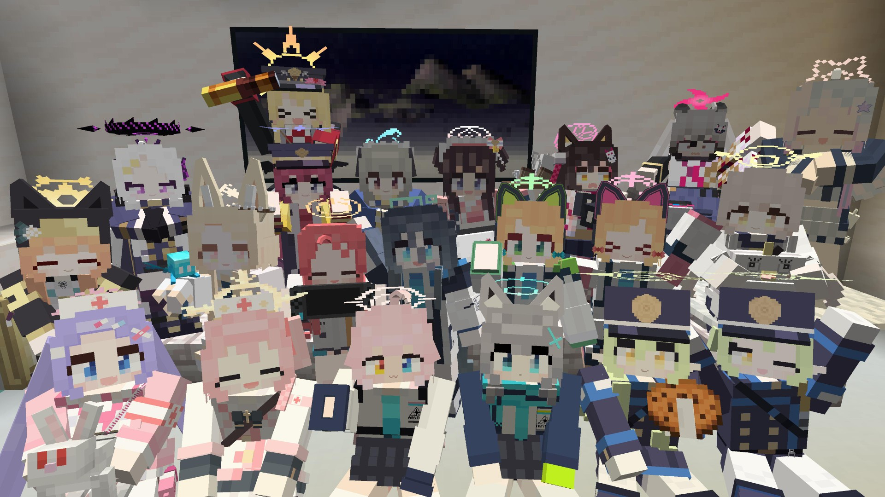

<https://youtu.be/JrPhLR34mLA>

---

**\[NEW!\]** 先生の日常をイメージして作ったFBACアニメーション動画を公開しました！
是非ご覧ください！

<https://youtu.be/GfJJ7iNA_Bs>

---

こちらもどうぞ：

- [FBAC動画 再生リスト](https://youtube.com/playlist?list=PLTN-ereqPxq9N_3SI0zvIE-f6MhBpZ52U&si=AOZ1et55lUzqA-lm)
- [FBACショート動画 再生リスト](https://youtube.com/playlist?list=PLTN-ereqPxq9OP7sIgSyHLK9JXk4mxIKk&si=ddSN5eqrJqhgsUfN)

## 作成状況

### 作成済み

これらのキャラクターのアバターは完成しました。
「[使用方法](https://github.com/Gakuto1112/FiguraBlueArchiveCrafters/blob/base/.github/README_jp.md#使用方法)」の章に従ってダウンロード及びゲーム内での使用が可能です。

- 河和 シズコ
- 久田 イズナ
- 伊落 マリー
- 才羽 モモイ
- 才羽 ミドリ
- 砂狼 シロコ
- 小鳥遊 ホシノ
- 里浜 ウミカ
- 鷲見 セリナ
- 棗 イロハ
- 丹花 イブキ
- 百合園 セイア
- 天童 アリス
- 花岡 ユズ
- 橘 ヒカリ
- 橘 ノゾミ
- 宇沢 レイサ
- 千鳥 ミチル
- 阿慈谷 ヒフミ
- 空崎 ヒナ
- 朝顔 ハナエ

### 作成中

これらのキャラクターのアバターは作成中です。
通常は2~3週間程を製作に要しますが、最近は多忙により更新が遅れています。
括弧内のリンクをクリックすると対象のissueに移動でき、そこで進捗を確認できます。

- ケイ（[#162](https://github.com/Gakuto1112/FiguraBlueArchiveCrafters/issues/162)）

### 作成予定

これらのキャラクターのアバターは作成していないものの、今後作成する予定です。
上から順に作成予定です。
これはあくまでも予定であり、順番が変更されたり作成を中止したりする可能性があります。

- 花岡 ユズ（臨戦）（[#161](https://github.com/Gakuto1112/FiguraBlueArchiveCrafters/issues/161)）
- 白洲 アズサ（[#155](https://github.com/Gakuto1112/FiguraBlueArchiveCrafters/issues/155)）
- 早瀬 ユウカ（[#102](https://github.com/Gakuto1112/FiguraBlueArchiveCrafters/issues/102)）
- 黒見 セリカ（[#37](https://github.com/Gakuto1112/FiguraBlueArchiveCrafters/issues/37)）

### リクエスト

これらのキャラクターのアバターは作成のリクエストを受けました。
ただし、リクエストを受けたからといって、必ず作成するとは約束できません。
ご了承ください。

- 伊草 ハルカ（[#98](https://github.com/Gakuto1112/FiguraBlueArchiveCrafters/issues/98)）
- 飛鳥馬 トキ（[#104](https://github.com/Gakuto1112/FiguraBlueArchiveCrafters/issues/104)）
- 陸八魔 アル（[#103](https://github.com/Gakuto1112/FiguraBlueArchiveCrafters/issues/103)）
- 杏山 カズサ（[#114](https://github.com/Gakuto1112/FiguraBlueArchiveCrafters/issues/114)）
- 調月 リオ（[#116](https://github.com/Gakuto1112/FiguraBlueArchiveCrafters/issues/116)）
- 羽川 ハスミ（[#128](https://github.com/Gakuto1112/FiguraBlueArchiveCrafters/issues/128)）
- 浅黄 ムツキ（[#129](https://github.com/Gakuto1112/FiguraBlueArchiveCrafters/issues/129)）
- 秋泉 モミジ（[#138](https://github.com/Gakuto1112/FiguraBlueArchiveCrafters/issues/138)）
- 柚鳥 ナツ（[#139](https://github.com/Gakuto1112/FiguraBlueArchiveCrafters/issues/139)）
- 仲正 イチカ（[#140](https://github.com/Gakuto1112/FiguraBlueArchiveCrafters/issues/140)）
- 剣先 ツルギ（[#145](https://github.com/Gakuto1112/FiguraBlueArchiveCrafters/issues/145)）
- 鰐渕 アカリ（[#146](https://github.com/Gakuto1112/FiguraBlueArchiveCrafters/issues/146)）
- 春原 シュン（[#153](https://github.com/Gakuto1112/FiguraBlueArchiveCrafters/issues/153)）
- 角楯 カリン（[#154](https://github.com/Gakuto1112/FiguraBlueArchiveCrafters/issues/154)）

## 特徴

- Exスキルのカットインを再現しています。

  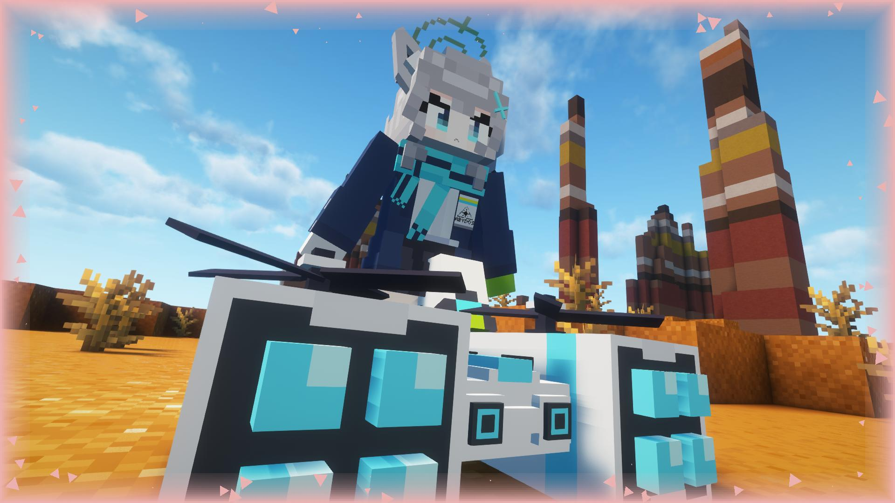

- 「場に何かを残す」タイプのスキルの場合、Exスキルアニメーション後にオブジェクトが残り続けます。
  - ゲームには一切影響を与えません。
  - オブジェクトとブロックの当たり判定が重なった時に、そのオブジェクトは消えます。
  - Exスキルの再生キー（デフォルト：V）を長押しすると設置物を全削除できます。

  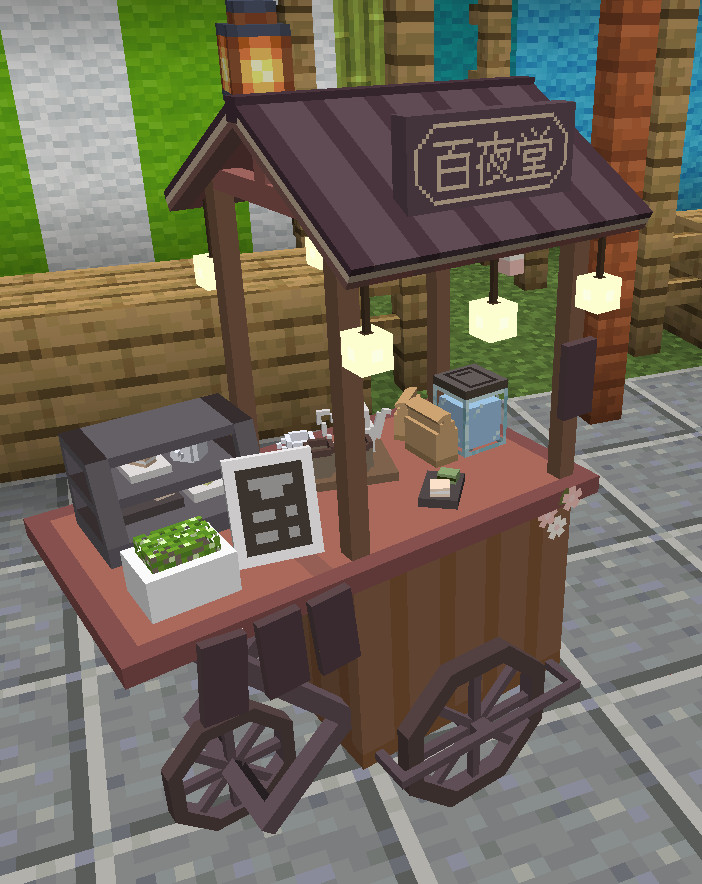

- 弓やクロスボウの代わりに生徒固有の武器を構えます。
矢の代わりに銃弾が発射されます。
  - 変化するのは見た目だけであり、実際はただ矢を撃っているだけなのでご注意下さい。

  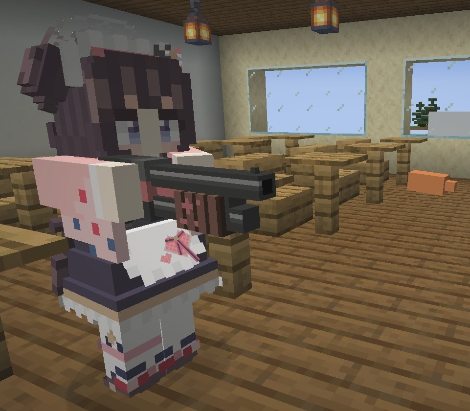

- カーソルキー（↑→↓←）で吹き出しを表示できます。
  - クロスボウに装填中は自動で装填の吹き出しが表示されます。

  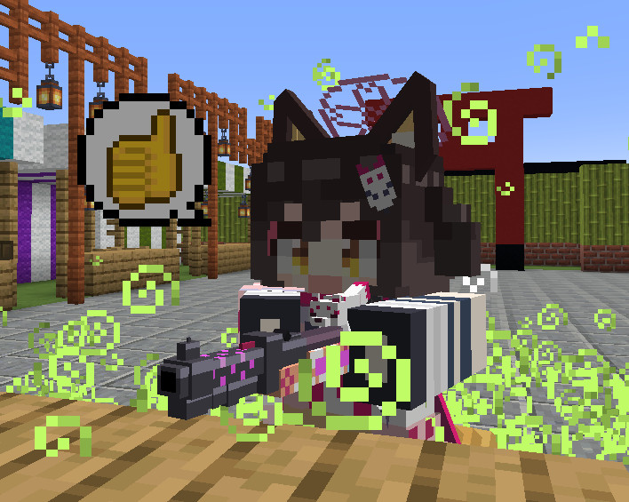

  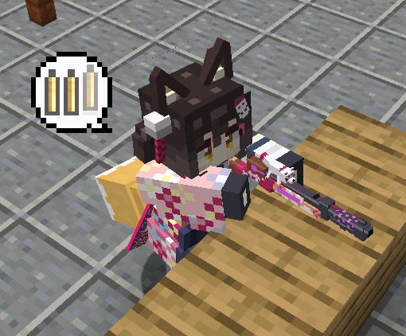

- 衝撃吸収のハート（黄色のハート）を持っている場合は、バリアが付きます。

  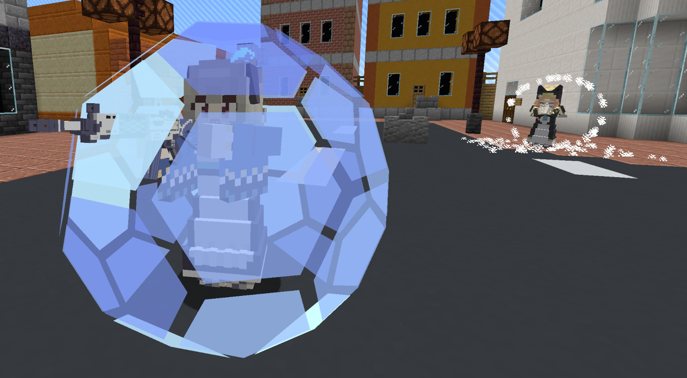

- プレイヤーが死ぬとヘリコプターで回収されます。
  - MinecraftやFiguraの仕様上、プレイヤーが表示されていないとこのアニメーションが表示されません。

  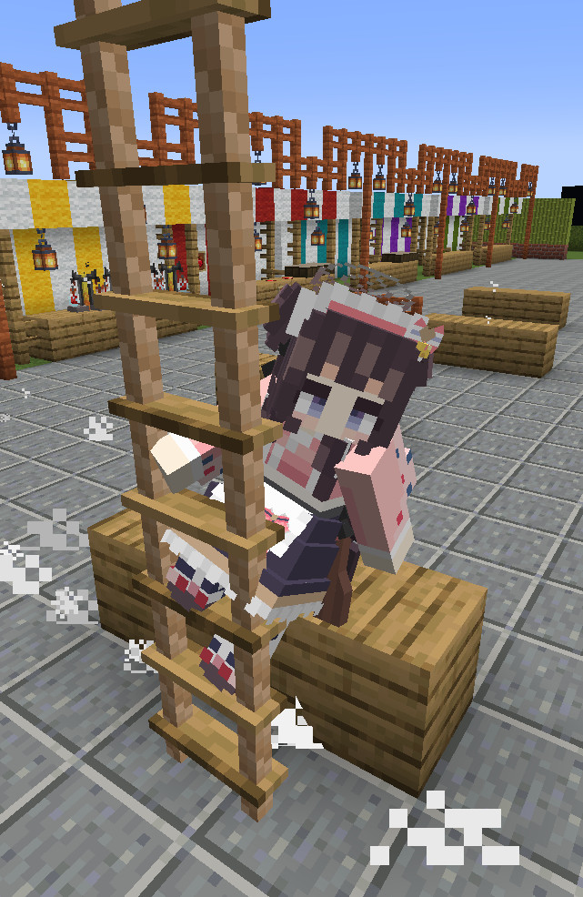

- 一部の生徒には、ゲーム内の乗り物向けの固有モデルがあります。

  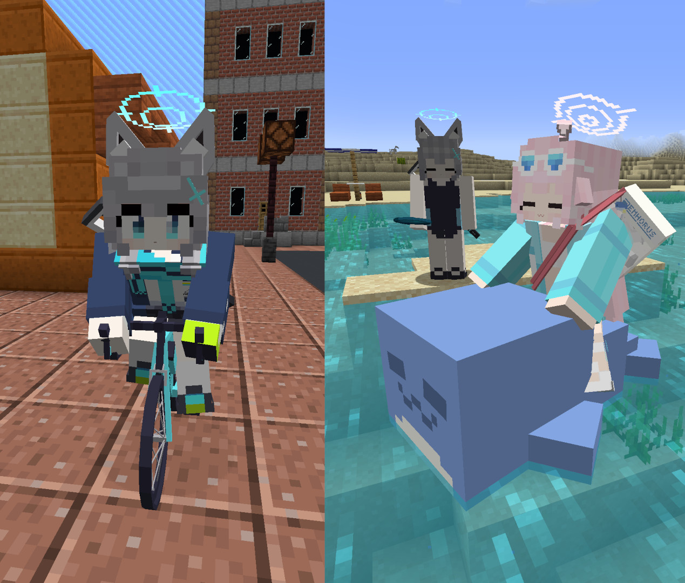

- プレイヤーの名前を生徒の名前にすることができます。
  - 部活名を表示することもできます。
  - 他のプレイヤーがこの名前を見えるようにするには、**他のプレイヤーもFiguraを導入し、他のプレイヤー側であなたに対する信頼設定を十分上げる必要があります。**

  

- 生徒の誕生日には（ささやかながら）名前にケーキマークが付きます。
  - 表示名がプレイヤー名である場合は表示されません。

  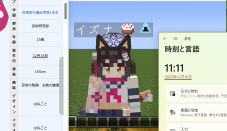

- 上記以外にも、特定の生徒のみで利用可能な機能があります。

  | 生徒名 | 機能 |
  | - | - |
  | シズコ（通常） | - Exスキル再生後に屋台をその場に残します。 |
  | イズナ | - エンダーパールなどでのワープ時に特別な演出があります。 |
  | シロコ | - クリエイティブ飛行ではドローンに捕まって飛びます。   - ドローンはミサイルが撃てます（視覚的な演出のみ）。  - サドル付きの馬系に乗ると馬が自転車に置き換えられます。   - 自転車に乗っているときは飲む系のポーションがスポーツ水筒になります。 |
  | ホシノ | - 盾が独自のモデルに置き換えられます。 |
  | ホシノ（水着） | - ボートに1人乗りしている場合のみ、ボートがクジラのフロートに置き換えられます。 |
  | ホシノ（臨戦） | - 両手で弓やクロスボウを持つとショットガンとハンドガンを持ちます。 |
  | ウミカ | - Exスキル再生後に花火台をその場に残します。   - 花火台は花火が撃てます（視覚的な演出のみ）。 |
  | セリナ（通常） | - Exスキル再生後に救急箱をその場に残します。   - 救急箱に触れると回復するような演出があります（他のプレイヤーでも可）。   - 治療のポーションが救急箱に置き換えられます。 |
  | セリナ（クリスマス） | - 鐘がハンドベルに置き換えられます。   - Exスキル再生後にハンドベルでランダムなクリスマスソングを演奏できます（7種類）。 |
  | イロハ | - サドル付きのラクダに1人乗りしている場合のみ、ラクダが虎丸（戦車）に置き換えられます。イブキのみ、虎丸に同乗が可能です。   - 虎丸は砲弾が撃てます（視覚的な演出のみ）。 |
  | イブキ | - イロハせんぱいとパトロールできるよ！ |
  | セイア | - お供として[アレイ](https://ja.minecraft.wiki/w/アレイ)を連れています（シマエナガの代わりです）。   - サドル付きの馬系に乗ると馬がオープンカーに置き換えられます。 |
  | アリス | - Exスキルアニメーションを再生した後はレールガンがオーバーチャージ状態となり、より強力な一撃を放てます（視覚的な演出のみ）。 |
  | アリス（臨戦） | - クリエイティブ飛行に専用のアニメーションがあります。 |
  | ユズ（メイド） | - カボチャを頭に被ることでユズチェストを装備できます。スニークすることでチェストに身を隠します。 |
  | ヒカリ | - ノゾミと一緒にダンスを踊れます。 |
  | ノゾミ | - Exスキル再生後に汽車を突進させます（視覚的な演出のみ）。   - ヒカリと一緒にダンスが踊れます。 |
  | レイサ（通常） | - Exスキル再生後に目の前に挑戦状を叩きつけます。何やら挑戦的な言葉が書かれています。 |
  | レイサ（マジカル） | - Exスキル再生後にささやかながらマジカルパワーを手にします。 |
  | ミチル | - エンダーパールなどでのワープ時に特別な演出があります。  - 剣やロケット花火が独自のモデルに置き換えられます。 |
  | ヒフミ（通常） | - Exスキル再生後にペロロ人形を目の前に設置します（視覚的な演出のみ）。 |
  | ヒフミ（水着） | - サドル付きのラクダに1人乗りしている場合のみ、ラクダがクルセイダーちゃん（戦車）に置き換えられます。   - クルセイダーちゃんは砲弾が撃てます（視覚的な演出のみ）。 |
  | ヒナ（水着） | - カメの甲羅（ヘルメット）を装備すると浮き輪を装備します。防具が表示されている場合では適用されません。 |
  | ハナエ（通常） | - 再生のポーションが救急箱に置き換えられます。 |

## Exスキル

本家でお馴染みのExスキルのカットインが再現されています。
Exスキルを再生するには、**三人称視点で**Exスキルのキー（デフォルトは「G」キー）を押してください。

> [!IMPORTANT]
> v1.9.4より、Exスキルのアクションの再生キーが「V」キーから「G」キーに変更されました。

一部の生徒さんは、Exスキルを2つ持っています。
2つ目のExスキルは「H」キーで再生できます。

Exスキルのカットインは見た目だけであり、効果は特にありません。
ただし、Exスキルによってはカットインの後にオブジェクトをその場に残すものもあります（こちらも見た目だけです）。

> [!NOTE]
>
> - Exスキルアニメーションは画面比率が16:9の場合を想定して作られています。
>   16:9以外の画面比率でもExスキルアニメーションは再生できますが、見切れる可能性があります。
> - Exスキルアニメーションは視野（FOV）が標準（70）である場合を想定して作られています。
>   標準以外の場合でExスキルアニメーションを再生すると一時的に視野が標準になるよう補正されます。
>   ただし、一部のmodの同時使用や移動速度の変化による視野の変化の場合は正常な補正がされません。

## アクションホイール

Figuraには、アクションホイールキー（デフォルトは「B」キー）を押すことで、エモートなどを実行できるリングメニューが実装されています。
このレポジトリのアバターには共通したアクションが用意されています。

> [!IMPORTANT]
> v1.8.4より、Exスキルのアクションはキー押下で再生されるように変更されました。

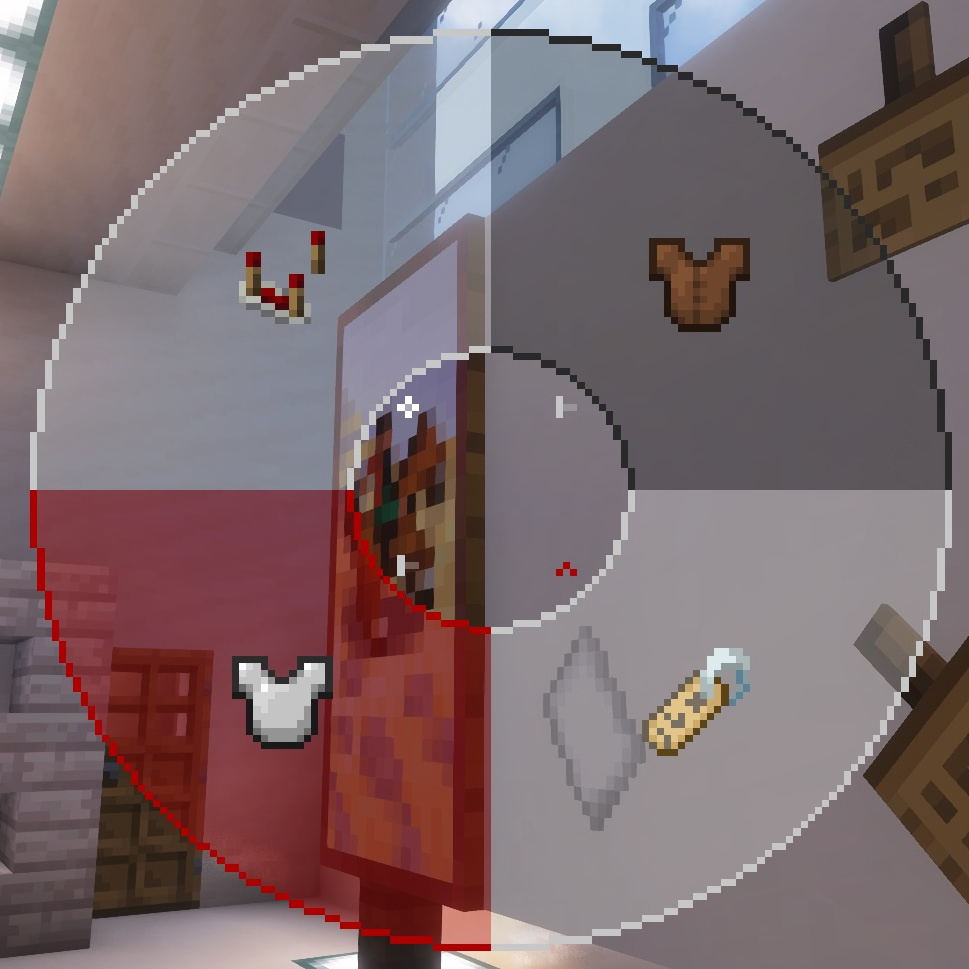

### アクション1. バリエーションへの変更

バリエーション衣装(Exスキルの変更を伴わない衣装変更)があれば衣装を変更できます。

### アクション2. 名前変更

プレイヤーの表示名を変更します。スクロールで表示名を選択し、アクションホイールを閉じると確定します。
選択中に左クリックをすると現在の設定値に、右クリックすると初期値にリセットされます。
ただし、他のプレイヤーが変更された名前を見るには、**そのプレイヤーもFiguraを導入し、他のプレイヤー側であなたに対する信頼設定を十分上げる必要があります。**

### アクション3. 防具の表示の切り替え

防具を表示するかどうかを設定できます。
ただし、折角のアバターが隠れてしまうので、防具を非表示にすることをお勧めします。

### アクション4. アバター設定に移動

[アバターの設定ページ](#アバター設定アクションホイール)に移動します。

## アバター設定アクションホイール

[アクションホイールのアクション4](#アクション4-アバター設定に移動)からアバター設定ページに移動できます。

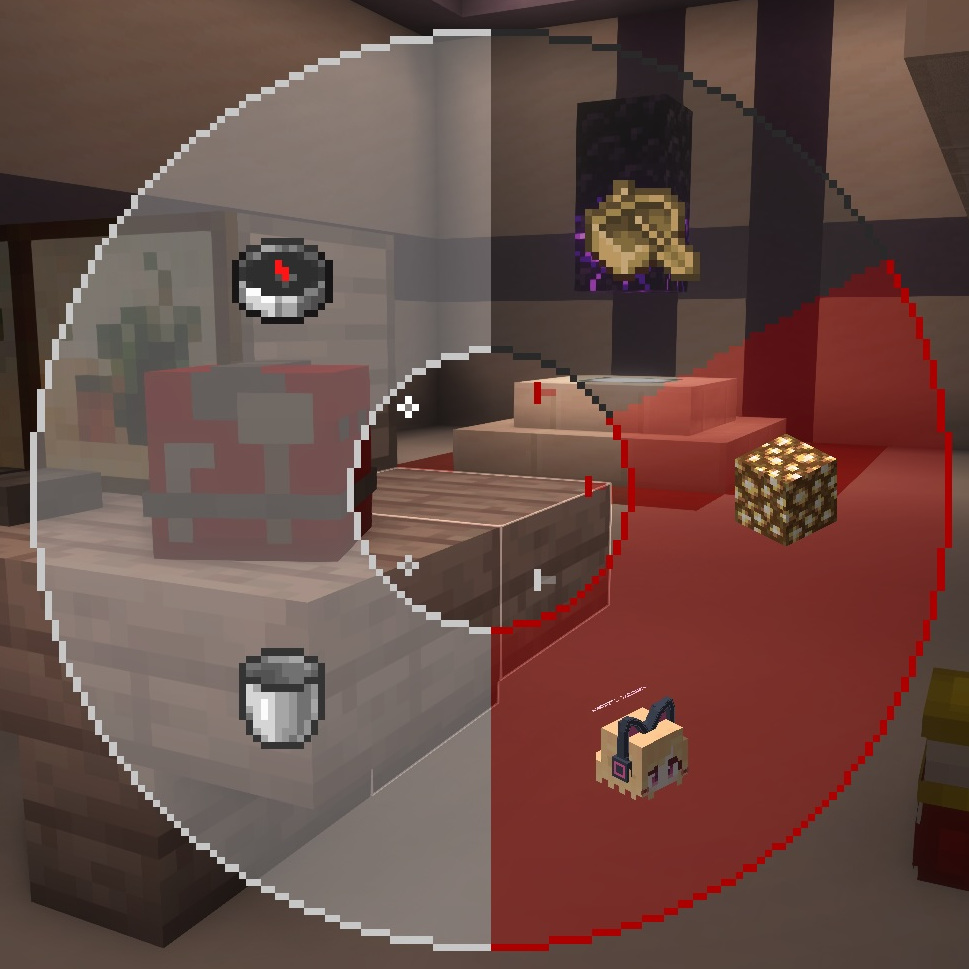

### アクション1.　生徒固有の乗り物モデルに置き換え

一部生徒の「ゲーム内の乗り物に乗った時にそのモデルを置き換える」機能の有効/無効を切り替えます。
乗り物モデルの置き換えがない生徒ではこのオプションが無効化されています。

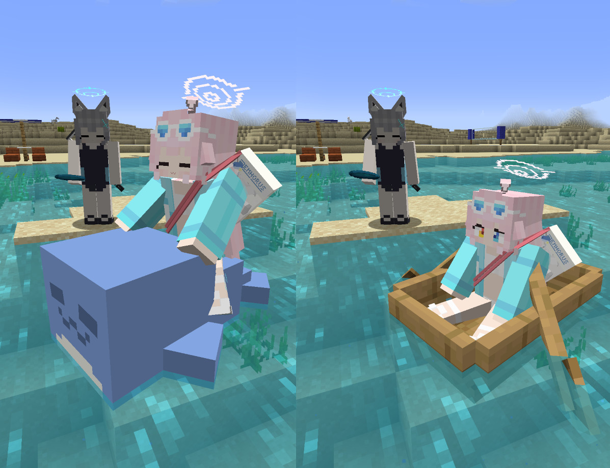

### アクション2. ヘイロー強制描画モードの切り替え

ヘイローの強制描画モードを有効有効/無効を切り替えます。

[本家設定を再現するため](https://dic.pixiv.net/a/ヘイロー%28ブルーアーカイブ%29#:~:text=シナリオライターが言及\)-,ヘイローは影が投影されない%E3%80%82)、シェーダーパック使用時にヘイローの影が投影されないようになっています。
この仕様の副作用により、一部の状況下ではヘイローが正常に描画されない場合があります。
その場合はヘイロー強制描画モードを有効にしてください。
なおこのモードは、アバターを読み込む度に、オフにリセットされます。

#### 確認したヘイローが描画されないシーン

- シェーダーパック使用時に[Freecam](https://modrinth.com/mod/freecam)でフリーカメラ視点にしているとき

### アクション3. FPM互換モード

[First-person Model](https://modrinth.com/mod/first-person-model)と互換性を持たせるためのモードです。
有効にすると、一人称視点の場合のみ頭を非表示にします。
特定の環境下では頭が描画されない場合があるので、その場合はこのモードを無効にしてください。

#### 確認した頭が描画されないシーン

- [Freecam](https://modrinth.com/mod/freecam)でフリーカメラ視点にしているとき

### アクション4. 言語データの再読み込み

クリックすると、FBACアバターの言語データのキャッシュを削除し、リモートから再読み込みします。
言語データに問題が生じたや手動で更新したい場合にお使いください。
なお、ここで手動で更新するほかに、1日1回自動的に更新確認を行い、新しいものがある場合は自動で更新します。

> [!IMPORTANT]
> アップデートの確認を行うには、Figuraの設定から、「Allow Networking」を有効にし、`raw.githubusercontent.com`を通信許可リストに入れる必要があります！

> [!CAUTION]
> FiguraのNetworking機能を有効にする際に、ネットワークフィルターを「Whitelist」以外で運用するのは危険です。
> このアバターでは安全なリンクを利用しますが、他のプレイヤーのアバターが利用するリンクが安全である保障はありません。
> また、この機能を使用して発生したいかなる損害の責任も負いかねます。

### アクション5. FBACアップデートの確認

左クリックすると、FBACのアップデートがあるかどうかを確認します。
アップデートの確認が失敗しても、このアクションからアップデートの確認を再試行できます。
なお、ここより手動でアップデートを確認するほかに、1日1回自動的にアップデートの確認を行います。

> [!IMPORTANT]
> アップデートの確認を行うには、Figuraの設定から、「Allow Networking」を有効にし、`api.github.com`を通信許可リストに入れる必要があります！

> [!CAUTION]
> FiguraのNetworking機能を有効にする際に、ネットワークフィルターを「Whitelist」以外で運用するのは危険です。
> このアバターでは安全なリンクを利用しますが、他のプレイヤーのアバターが利用するリンクが安全である保障はありません。
> また、この機能を使用して発生したいかなる損害の責任も負いかねます。

> [!WARNING]
> アップデートの確認を短時間で繰り返し行うと、一時的にGitHub側から制限が課せられ、しばらくの間アップデートの確認を行えなくなります。

右クリックすると、最新のFBACのダウンロードリンクをクリップボードにコピーします。
お使いのブラウザからダウンロードページにアクセスしてください。
なお、1回もアップデートの確認を行っていなかったり、長期間アップデートの確認を行っていなかったりする場合は正常なリンクを取得できませんのでご注意ください。

## FBACバージョン表示

v2.0.0より、アクションホイールを開けている際に、画面左上に現在使用中のFBACのバージョンとアップデートの有無が表示されます。
更にv3.0.0より、言語データのバージョンも表示されます。

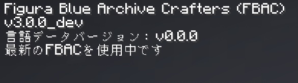

FBAC及び言語データのアップデートの確認は、1日1回自動で行われますが、[アクションホイール](#アバター設定アクションホイール)より手動で行うこともできます。

新しいFBACバージョンが利用可能な場合は、通知が送信されます。
[アクションホイール](#アバター設定アクションホイール)より最新バージョンのダウンロードリンクが取得できますので、お使いのブラウザからアクセスしてください。

新しい言語データバージョンが利用可能な場合は、自動的にダウンロードされます。
特に特別な操作を行う必要はありません。

> [!IMPORTANT]
> アップデートの確認を行うには、Figuraの設定から、「Allow Networking」を有効にし、`api.github.com`及び`raw.githubusercontent.com`を通信許可リストに入れる必要があります！

> [!CAUTION]
> FiguraのNetworking機能を有効にする際に、ネットワークフィルターを「Whitelist」以外で運用するのは危険です。
> このアバターでは安全なリンクを利用しますが、他のプレイヤーのアバターが利用するリンクが安全である保障はありません。
> また、この機能を使用して発生したいかなる損害の責任も負いかねます。

> [!WARNING]
> アップデートの確認を短時間で繰り返し行うと、一時的にGitHub側から制限が課せられ、しばらくの間アップデートの確認を行えなくなります。

## 言語データ

FBAC v3.0.0から、アバター内で使用する言語データは、初期化時の必要最小限分を除き、全てリモート上に置かれたリソースから取得するように変更されました。
これにより、今までは英語と日本語のみでしたが、他の言語にも翻訳することが可能となりました。
以下のレポジトリにおいて作業中でありますので、お時間があるよって方がいましたら翻訳作業に協力いただけますと幸いです。

<https://github.com/Gakuto1112/FBAC_Locales>

なおこの仕様により、インターネットの接続に問題がある場合に言語データの取得がうまく行えず、内部キーのみの表示となることがあります。
アバターの動作においては問題はありませんので、ご理解のほどをお願いします。
また、明らかに不具合だと思われる事象がありましたら、[Issues](https://github.com/Gakuto1112/FiguraBlueArchiveCrafters/issues)まで報告いただけますと幸いです。

## 使用方法

Figuraは[Forge](https://files.minecraftforge.net/net/minecraftforge/forge/)、[Fabric](https://fabricmc.net/)、[NeoForge](https://neoforged.net/)に対応しています。

1. 使用したいModローダーをインストールし、Modを使用できる状態にします。
2. [Figura](https://modrinth.com/mod/figura)を追加します。Modの依存関係にご注意ください。
3. [リリースページ](https://github.com/Gakuto1112/FiguraBlueArchiveCrafters/releases)に移動します。
4. リリースノート内の「Assets」の項目に添付されているzipファイルをダウンロードします。
5. 圧縮ファイルを展開し、中にあるアバターデータを取り出します。
6. `<マインクラフトのゲームフォルダ>/figura/avatars/`にアバターのデータを配置します。
   - Figuraを導入した状態で一度ゲームを起動すると自動的に作成されます。存在しない場合は手動での作成も可能です。
7. ゲームメニューからFiguraメニュー（Δマーク）を開きます。
8. 画面左のアバターリストからアバターを選択します。
9. アバターを正常に動作させるため、ネットワーク通信を許可する必要あります。
   Figuraメニュー →　設定 → 「Networking」カテゴリー に移動し、以下の設定値を更新してください。
   - Allow Networking → 「オン」
   - Networking Restriction → 「Whitelist」
10. 同カテゴリー内の「Network Filter」に以下のエントリーを追加してください。
    - api.github.com
    - raw.githubusercontent.com
11. Figuraメニューよりアバターをアップロードすることで、他のFiguraプレイヤーもあなたのアバターを見ることができます。
    - **海賊版（割れ、非正規版、無料版）のマインクラフトでは、アバターをアップロードすることはできません。**
     これはFiguraの仕様であり、これに関しては対応できません。

## 注意事項

- このアバターを使用して発生した、いかなる損害の責任も負いかねます。
- このアバターは、デフォルトのリソースパックでの動作を想定しています。
  また、他MODの使用は想定していません。
  想定動作環境外ではテクスチャの不整合、防具が表示されない/非表示にならない、といった不具合が想定されます。
  この場合の不具合は対応しない場合がありますのでご了承下さい。
- 不具合がありましたら、[Issues](https://github.com/Gakuto1112/FiguraBlueArchiveCrafters/issues)までご連絡下さい。
- アバター関係で私に連絡したい方は[Discussions](https://github.com/Gakuto1112/FiguraBlueArchiveCrafters/discussions)または、[Discord](https://discord.com/)でご連絡ください。
  私のDiscordのアカウント名は「vinny_san」で表示名は「ばにーさん」です。[FiguraのDiscordサーバー](https://discord.gg/figuramc)での表示名は「BunnySan/ばにーさん」です。

## ローカルでのアバタービルド

本レポジトリをクローンして使用する場合には、ビルドツールによるアバターのビルドが必要です。
詳しくは[ビルドツールの説明](./build_scripts/README_jp.md)をご覧ください。

---

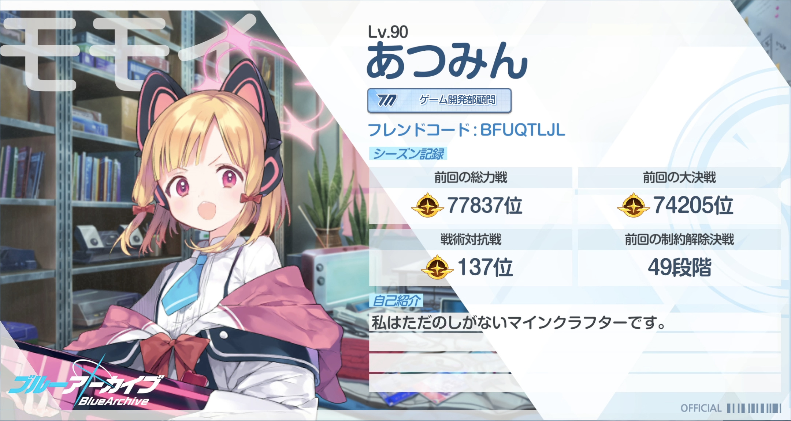
