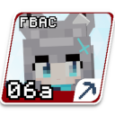
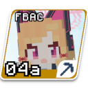
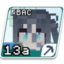
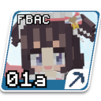
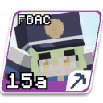

Language: 　**English**　|　[日本語](./README_jp.md)

# FBAC Build Tool

This command-line tool converts (builds) source files for Figura Blue Archive Crafters (FBAC) avatars into data that can be used in the game.

## FBAC Source File Structure

The FBAC source files (models, textures, scripts, and other metadata) are divided into two parts: the "core part" and the "character-specific part".

### Core Part

The core part refers to the resources related to systems common to all characters (expressions, halos, Ex-skill playback logic, etc.).
The core is stored under "[/src/core](https://github.com/Gakuto1112/FiguraBlueArchiveCharacters/blob/main/src/core)".

#### avatar_template.json

"[avatar_template.json](https://github.com/Gakuto1112/FiguraBlueArchiveCharacters/blob/main/src/core/avatar_template.json)" is a template file for building "[avatar.json](https://figura-wiki.pages.dev/start_here/Avatar%20File%20Format)" to let Figura recognize it as an avatar.
The structure of the template file is almost identical to that of "avatar.json", but placeholders are enabled on some fields where specific values will be inserted during the build process.

| Placeholder Name | Description | Examples of Specific Values | Supported Fields |
| --- | --- | --- | --- |
| AVATAR_ID | Character ID | "01a", "01b", ... | name |
| FIRST_NAME | Character's given name | "Shizuko", "Izuna", ... | name, description |
| LAST_NAME | Character's surname | "Kawawa", "Kuda", ... | description |
| COSTUME_NAME | Character's costume name <br> Including parentheses ("()"). It will be an empty string for the default costume. | "(Swimsuit)", "(Tracksuit)", "" | name, description |

### Character-Specific Part

The character-specific part refers to the resources specifically implemented for a particular character based on the core.
The character-specific part is stored under "[/src/avatars](https://github.com/Gakuto1112/FiguraBlueArchiveCharacters/blob/main/src/avatars)", and the respective resources are further stored in each character's subdirectory.
However, "[00a_base](https://github.com/Gakuto1112/FiguraBlueArchiveCharacters/blob/main/src/avatars/00a_base)" acts as a boilerplate avatar when creating a new character.
In other words, it is the "base body" avatar for the characters.

The naming conventions for character subdirectories are as follows.
Note that character names and costume names are written in English.
Also, the first letter should be capitalized, with subsequent letters in lowercase.

- (For default costume) ... `${CharacterID}_${CharacterFirstName}`
- (For different costumes) ... `${CharacterID}_${CharacterFirstName}_${CostumeName}`

#### avatar_json_config.json

"[avatar_json_config.json](https://github.com/Gakuto1112/FiguraBlueArchiveCharacters/blob/main/src/avatars/00a_base/avatar_json_config.json)" is a file used to insert and merge concrete values into the core's "[avatar_template.json](#avatar_templatejson)".
The structure of this json file is as follows:

```
📃 avatar_json_config.json
├ 📁 placeholders{}
│ ├ 🔠 first_name
│ ├ 🔠 last_name
│ └ 🔠 (costume_name)
├ 📁 ignoredTextures[]
│ └ 🔠 texture_name
├ 📁 autoAnims[]
│ └ 🔠 animation_name
└ 📁 customizations{}
  └ 📁 ...
```

(🔢: Number, 🔠: String, ▶️: Boolean, 📁[]: Array, 📁{}: Dictionary, (): Optional Field)

`placeholders` holds the concrete values to be inserted into the placeholders in "avatar_template.json".

| Placeholder Name | Description | Examples of Specific Values | Is Required Field? |
| --- | --- | --- | --- |
| first_name | Character's given name | "Shizuko", "Izuna", ... | Yes |
| last_name | Character's surname | "Kawawa", "Kuda", ... | Yes |
| costume_name | Character's costume name <br> Do not include parentheses ("()"). | "Swimsuit", "Tracksuit", ... | No |

`ignoredTextures`, `autoAnims`, and `customizations` will be merged with the fields of the same names in "avatar_template.json" during the build.
If there are duplicate keys, they will be overwritten with the values from "avatar_json_config.json".

#### thumbnail_config.json

"[thumbnail_config.json](https://github.com/Gakuto1112/FiguraBlueArchiveCharacters/blob/main/src/avatars/00a_base/thumbnail_config.json)" is a file storing the configuration values used when generating avatar thumbnails.
The structure of this json file is as follows:

```
📃 thumbnail_config.json
└ 🔠 colorType
```

`colorType` receives a value determining the color of the thumbnail image (the blue area in the example above).
The enumeration value names are based on the attack/defense attribute names in the original Blue Archive.
The valid values are below:

| Value Name | Description | Example |
| --- | --- | --- |
| explosive | Explosive (Red) |  |
| penetration | Penetration (Yellow) |  |
| chemical | Chemical (Green) |  |
| mystic | Mystic (Blue) |  |
| sonic | Sonic (Purple) |  |

## Setup and Execution Steps

The following steps show how to clone this repository and actually build an avatar.
Please note that running this build tool requires [uv](https://docs.astral.sh/uv/), which is a Python version management tool.
The command examples in the steps are based on Mac/Linux.

1. Clone (download) this repository and extract the files onto your device.
2. Set the working directory to "/src/build_script".

   ```sh
   cd <path_to_repository_root_directory>/build_scripts/
   ```

3. Install Python and dependencies.
   You can install them simply by running the following command.

   ```sh
   uv sync
   ```

4. Execute the build script.
   By default, the built avatars will be output in `../dist/`.

   ```sh
   uv run build.py
   ```

## Build Tool Optional Arguments

This build tool provides optional arguments.

| Argument Name | Additional Argument | Description |
| --- | --- | --- |
| -h, --help | None | Outputs the build tool's description. |
| -c, --character | Valid avatar name <br> (e.g., "01a", "Shizuko", "01a_Shizuko") | Builds only one specific character. If this argument is not specified, all avatars including the base character will be built. This has no effect in watch mode. |
| -i, --src-dir | Path to the directory of avatar sources | Specifies the directory of avatar sources. If this argument is not specified, it will be `../src/`. |
| -o, --dist-dir | Path to the output destination directory | Specifies the output destination directory. If this argument is not specified, it will be `../dist/`. |
| -w, --observe | None | Launches the build tool in watch mode. In watch mode, after a normal build, if changes in source files are detected, it will automatically rebuild only the relevant parts. |
| -l, --colored | None | Adds color to standard output. Turn this off if control characters like log outputs are output as-is. |
| -d, --debug_output | None | Enables finer debug output. |
| -r, --release | None | Builds as release mode. It performs the build while removing feature implementations meant for debugging and changing endpoints to release versions. |

## Build Tool Operations

While the avatars are being built by the build tool, processes like the following are being executed:

1. Copy models, textures, and scripts for the core and character-specific parts

   Copies core and character-specific models, textures, and scripts to the same output destination to merge resources.
   If there are resources with the same relative paths on both the core and character-specific sides, they will be overwritten by the character-specific resources.

2. Generate "avatar.json"

   Based on "[avatar_template.json](#avatar_templatejson)", inserts specific values from "[avatar_json_config.json](#avatar_json_configjson)" to generate "avatar.json".
   For details of the specific process, check the [avatar_json_config.json section](#avatar_json_configjson).

3. Generate thumbnails

   Based on "[/thumbnail_templates/](https://github.com/Gakuto1112/FiguraBlueArchiveCharacters/blob/build_script_documentation/thumbnail_templates)", inserts specific data from "[thumbnail_config.json](#thumbnail_configjson)" and "[thumbnail.png](https://github.com/Gakuto1112/FiguraBlueArchiveCharacters/blob/build_script_documentation/src/avatars/01a_Shizuko/thumbnail.png)" to generate thumbnail images.
   If "thumbnail.png" does not exist, the thumbnail image will be generated skipping the insertion of the character image.

4. Compress texture images

   Compresses texture images using "[pngquant](https://pngquant.org)".

5. Modify model files

   Modifies model files as follows.

   - Replaces the embedded texture data with the compressed ones
   - Removes absolute paths of texture images
   - Removes reference images
