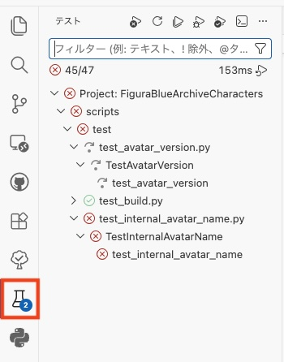

<!-- markdownlint-disable MD041 -->
言語: 　[English](./README.md)　|　**日本語**
<!-- markdownlint-enable MD041 -->

# FBACテストスクリプト

このスクリプトはFigura Blue Archive Crafters（FBAC）アバターのビルドが成功するかやソースファイルを設定値が正しいかを検査するスクリプトです。

## テスト項目

### ビルドテスト

[ビルドスクリプト](../build/README_jp.md)によるアバターのビルドが成功するかテストします。
ビルド途中にビルドスクリプトがエラーを出力するとテスト失敗です。

テスト実行時のビルドスクリプトの引数は全てデフォルト（未指定時のもの）です。

### アバター内部名称テスト

`src/avatars/${character_name}/blue_archive_character.lua`内の`BlueArchiveCharacter.basic.avatarName`が`character_name`と一致しているかテストします。
大文字/小文字も区別して調べます。
2つの名称が不一致だとテスト失敗です。

上記以外でも、以下のケースの場合はテスト失敗です。

- [`src/avatars/`](../../src/avatars/)ディレクトリが存在しない。
- `src/avatars/${character_name}/blue_archive_character.lua`が存在しない。
- `BlueArchiveCharacter.basic.avatarName`フィールドが定義されていない。

### アバターのバージョンテスト

[`src/core/scripts/action_wheel/update_checker.lua`](../../src/core/scripts/action_wheel/update_checker.lua)内の`UpdateChecker.AVATAR_VERSION`が指定されたリリースタグ名と一致しているかテストします。

このテストは一致するか調べる対象のリリースタグ名を追加引数で指定する必要があります。
指定しない場合は、テストがスキップされます。

上記以外でも、以下のケースの場合はテスト失敗です。

- [`src/core/scripts/action_wheel/update_checker.lua`](../../src/core/scripts/action_wheel/update_checker.lua)が存在しない。
- `UpdateChecker.AVATAR_VERSION`フィールドが定義されていない。

## 環境構築及び実行手順

本レポジトリをクローンし、実際にアバターをビルドするまでの手順を示します。
なお、本ビルドツールの実行にはPythonのバージョン管理ツールである[uv](https://docs.astral.sh/uv/)が必要です。
また、手順内にあるコマンド例はMac/Linux準拠になります。

1. 本レポジトリをクローン（ダウンロード）し、お使いのデバイス上にファイルを展開します。
2. ワーキングディレクトリを`/src/scripts`に設定します。

   ```sh
   cd <path_to_repository_root_directory>/scripts/
   ```

3. Python及び依存パッケージのインストールをします。
   以下のコマンドを実行するだけでインストールできます。

   ```sh
   uv sync
   ```

4. テストスクリプトを実行します。

   - ビルドテストの場合

     ```bash
     uv run python -m test.test_build
     ```

   - アバター内部名称テストの場合

     ```bash
     uv run python -m test.test_internal_avatar_name
     ```

   - アバターのバージョンテストの場合

     ```bash
     uv run python -m test.test_avatar_version ${release_tag_name}
     ```

また、[Visual Studio Code](https://code.visualstudio.com)を使用する場合は、画面左のテストタブからテストを容易に実行できます。\
（アバターのバージョンテストはタグプッシュ時にテストされることを想定しているため、ここで実行してもスキップされます。）


